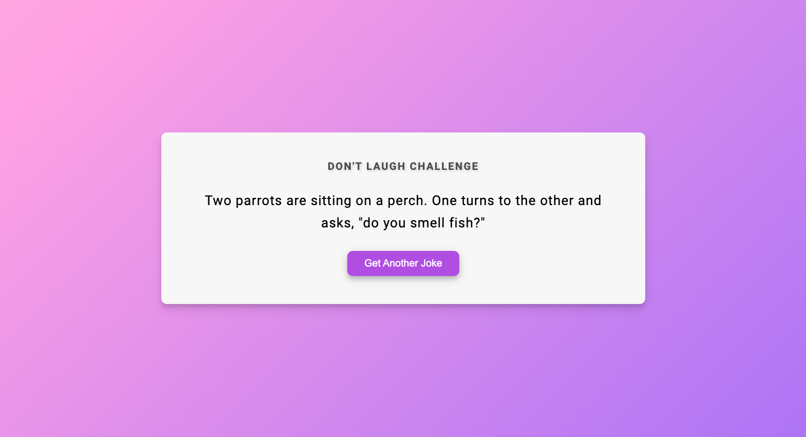

# Random Jokes App



A simple web application that displays random jokes to make you smile! This project was created using HTML, CSS, and JavaScript.

## Table of Contents

- [Demo](#demo)
- [Features](#features)
- [Getting Started](#getting-started)
  - [Prerequisites](#prerequisites)
  - [Installation](#installation)
- [Usage](#usage)
- [Contributing](#contributing)
- [Contact Us](#contact-us)


## Demo

You can check out a live demo of the Random Jokes App here: [Demo Link](https://your-demo-link-here.com)

## Features

- Display random jokes to brighten up your day.
- Easy-to-use and intuitive interface.
- Lightweight and fast loading.

## Getting Started

To get a local copy of this project up and running, follow these steps:

### Prerequisites

- You need a modern web browser.
- Any text editor for code editing (e.g., Visual Studio Code, Sublime Text, or Notepad++).

### Installation

1. Clone the repository to your local machine:

   ```bash
   git clone https://github.com/your-username/random-jokes-app.git
   ```
   
## Usage

1. Open the project folder in your preferred text editor.
   That's it! You're ready to use the Random Jokes App.

2. Open the `index.html` file in your web browser.

3. Click the "Get Joke" button to generate a random joke.

4. Enjoy the joke and share a laugh with your friends!

## Contributing

If you'd like to contribute to this project, please follow these guidelines:

1. Fork the repository.

2. Create a new branch for your feature or bug fix: `git checkout -b feature/your-feature-name` or `git checkout -b bugfix/your-bug-fix`.

3. Make your changes and commit them with descriptive commit messages.

4. Push your changes to your fork: `git push origin feature/your-feature-name` or `git push origin bugfix/your-bug-fix`.

5. Create a pull request to the `main` branch of the original repository, explaining your changes and why they should be merged.

## Contact Us

- Akash Rana
- Email (akashmanu2003@gmail.com)
- [Twitter](https://twitter.com/Akash08_18)
- [LinkedIn](https://www.linkedin.com/in/akashrana18)
- [Instagram](https://www.instagram.com/codewithakash/)


